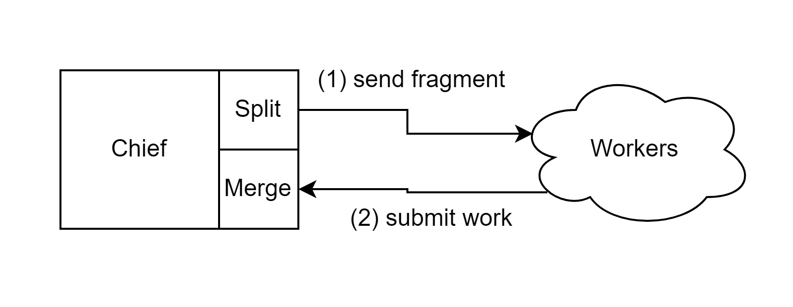

<body>
  <h1>Guidelines for the Butcher</h1>
  

    This document is intended to help you understand the purpose the Butcher plays in the 
  system, and how to implement it properly. We provide some sample module-packages in 
  the repository for reference. The idea is that it should be relatively easy to set this up while 
  providing enough flexibility for a wide range of applications.
  

  

    You are ultimately responsible for the correctness and the strategies chosen to implement each
  component.
  

  

    Any application that uses this framework requires what we call a <i>Butcher</i>. It is responsible for 
  segmenting your inputs and merging your outputs in a way that allows for compatibility with the 
  Parallel network. It consists of at least 2 required files, <i>“Split.py”</i> and <i>“Merge.py”</i>, you may 
  include any other helper files. Split will provide the ability for the chief to serve data fragments on 
  demand. Merge will combine your sub results into a combined final-result.
  

  
  <h1>Split.py</h1>
  
The main concept is to use python generators to serve your inputs on demand. What is a 
  generator you may ask. Put simply generators <i>yield</i> data instead of returning it like a normal 
  function. That means specifically that the generator loads one smaller chunk of data into memory 
  at a time. The generator saves its internal state before yielding the data and iterating to the next 
  state. With Python this is actually super easy to do in practice.

  

    It involves defining a function called <code>splitter(dataset_path:str)->bytes:</code> that segments your data or defines some kind of 
  iterable, <b>finite</b> input space. For example, when you normally move data to some kind of buffer in 
  a loop you can instead just yield it to the caller.
  

  
  <h1>Merge.py</h1>
  

    Merge takes all the work submitted back to the chief and combines the data however the 
  user sees fit. Results are merged in causal order and are cached by the chief. Your merger method 
  receives fragments that are causally related to each other, so you do not have to worry about 
  ordering when implementing the merger. So, if you receive 1 then 4, the chief will not merge 4 
  into the result until it receives 2 and 3. This is an option that could be turned off if it is not 
  applicable to you.
  

  

    This involves defining a function called <code>merger(fragment:bytes, job_name:str)</code> that takes a result segment and maps it to a 
  final result. This method has access to the results directory you can use it however you want. The 
  chief will tar this and send it back to you after completing the job.
  

  

    Our backend will use the methods you defined to segment data and merge results lazily as it 
  receives requests from workers.
  

  

  
  

  

    This diagram represents the processing loop. It starts when the client starts a job, using the splitter 
  to distribute the first round of fragments. As each worker finishes their task, they submit their work 
  back to the chief and it gets processed by the merger in turn causing another the next fragment to 
  be sent out to that worker. After the input space has been exhausted the chief will stop posting data 
  to the workers and wait for all the sub result.
  

  
  <h1>Requirements</h1>
  <ul>
    <li>NO component should exceed some maximum recursion depth enforced by the chief.</li>
    <li>The <code>splitter()</code> method defines a python generator using the <code>yield</code> keyword. No other method 
      in your package should yield anything.</li>
    <li>Your splitter does not produce infinite sequences.</li>
    <li>Your merger does not write more than some maximum amount of data enforced by the 
  chief</li>
    <li>The fragment size is at most the maximum size enforced by the chief.</li>
  </ul>

  <h1>Consequences</h1>
  <ul>
    <li>Your application will not work, and the network will refuse to execute the job.</li>
    <li>You will waste time writing an application that is not compatible with our architecture.</li>
    <li>Suspicious activity might trigger containers to reset and purge your code.</li>
    <li>You will most likely just waste your own resources and you may be blocked from accessing 
  the system.</li>
  </ul>

  <h1>Assistance</h1>
  
We suggest if you are having trouble picturing certain implementation details that you look 
  at the sample modules provided in the repository and play with them. We also encourage you to 
  use CHAT-GPT to help write this module if needed and you can provide it with the requirements. To 
  learn more about python generators you can read this article.
    <a href="https://realpython.com/introduction-to-python-generators/">python generators</a>

<h1>Example</h1>

This is a toy example that may help you picture whats going on here

<h3>Sample Split.py</h3>
<pre><code>import numpy as np
def splitter(dataset_path:str):    # example generator for an npy file (numpy array)
    with open(path, "rb") as file:
        while True:
            fragment:bytes = file.read(64) # the fragment size in bytes
            if not fragment:
                break
            yield np.frombuffer(fragment, dtype=np.int16)
</code></pre>
<h3>Sample Processor.py</h3>
<pre><code>import numpy as np
def Processor(fragment:bytes)->bytes:
    # do stuff here
    return fragment
</code></pre>
<h3>Sample Merge.py</h3>
<pre><code>
# append the result fragments to a file
def Merge(fragment:bytes, job_name:str):
    resultpath=f"/app/resources/{job_name}/results/result"
    with open(resultpath, "ab") as file:
        file.write(file, fragment)
        file.close()
</code></pre>
</body>